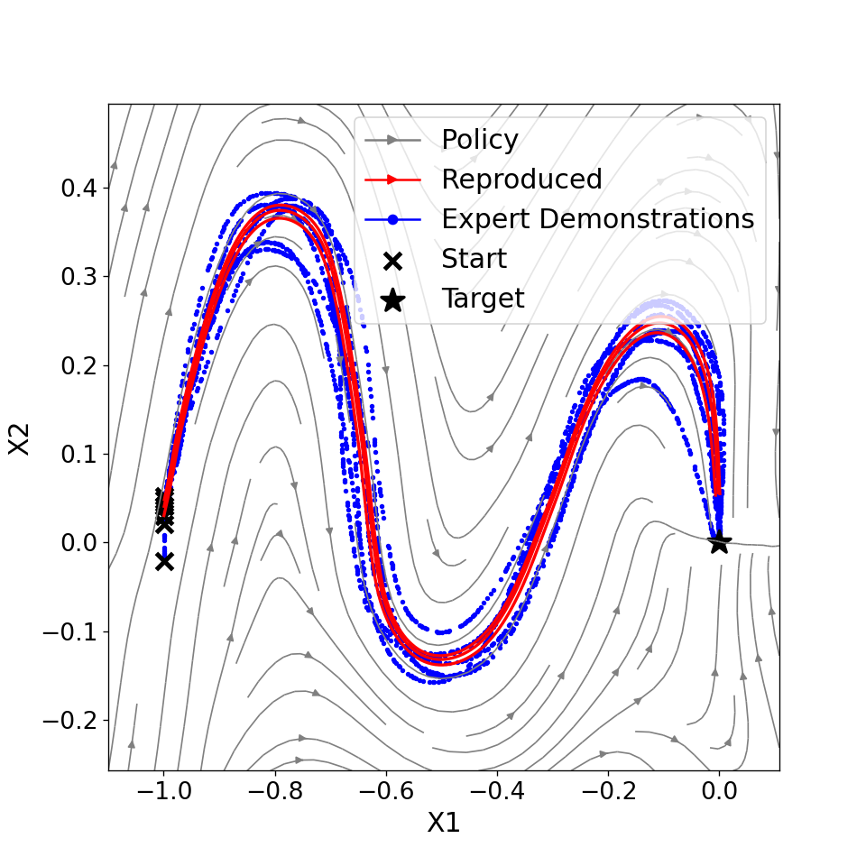

# Learning Stable Imitation Policies

## Overview

Imitation learning can be leveraged to tackle complex motion planning problems by training a policy to imitate an expert's behavior. However, relying solely on the expert's data can result in unsafe behaviors when the robot encounters unknown regions of the state space. To address this issue, we try various techniques for learning a stable nonlinear dynamical system as a motion planning policy.

This repository contains implementations of our two recently published efforts, namely:

* **SNDS** — A. Abyaneh, M. Sosa, H.-C. Lin. Globally stable neural imitation policies. International Conference on Robotics and Automation, 2024.

* **PLYDS** — A. Abyaneh and H.-C. Lin. Learning Lyapunov-stable polynomial dynamical systems through imitation. In 7th Annual
Conference on Robot Learning, 2023.




## Getting started

This section provides instructions on reproducibility and basic functionalities of the repository.

### Repository structure

To acquire a better understanding of the environment and features, you just need to clone the repository into your local machine. At first glance, the structure of the project appears below.

```bash
    ├── src          # Python source files of the project.
    ├── exp          # Targeted experiments with various planning methods.
    ├── data         # Figures and other data.
    ├── res          # Resources like saved policies.
    ├── sim          # Simulation files with PyBullet.
    ├── lib          # External libraries or reference codes.
    ├── .gitmodules  # Organizing the modules in lib folder.
    ├── LICENSE
    ├── CONTRIBUTING.md
    └── README.md
```

### Dependencies and Conda

All the dependencies for this project are summarized as a Conda environment in [environment.yaml](environment.yaml). The following command should automatically install the entire set of dependencies.

```bash
conda env create -f environment.yaml
```

Before running the above, make sure you have Conda installed, or install it from [Anaconda Website](https://conda.io/projects/conda/en/latest/user-guide/install/linux.html).

## Experimenting with SNDS

The [exp](exp/) folder contains most of the experiments and baselines comparisons. To prepare for running experiments, you need to navigate into the folder and use python to launch the file.

```bash
python3 nnds_training.py -nt snds -ms Sine -sp -nd 5 -ne 10000
```

These files utilize the argparse library, so you can easily check their help instructions to understand their functionality and available command-line options.

```bash
python nnds_training.py -h
```

This option works for any other python file in the folder. Make sure you are familiar with the command-line interface (CLI) options to save or plot the results, as they play a crucial role in obtaining the desired output. For instance, for PLYDS:

```cmd
usage: nnds_training.py [-h] [-nt NONLINEAR_TOOL] [-m MODE] [-ms MOTION_SHAPE] [-nd NUM_DEMONSTRATIONS] [-ne NUM_EPOCHS] [-sp] [-sm] [-sd SAVE_DIR]

Nonlinear DS experiments CLI interface.

optional arguments:
  -h, --help            show this help message and exit
  -nt NEURAL_TOOL, --neural-tool NEURAL_TOOL
                        The nonlinear policy or tool
                        among snds, sdsef, nn.
  -m MODE, --mode MODE  Mode between train and test. Test mode only loads the model with the provided name.
  -ms MOTION_SHAPE, --motion-shape MOTION_SHAPE
                        Shape of the trajectories as in LASA dataset.
  -nd NUM_DEMONSTRATIONS, --num-demonstrations NUM_DEMONSTRATIONS
                        Number of additional demonstrations to the original dataset.
  -ne NUM_EPOCHS, --num-epochs NUM_EPOCHS
                        Number of training epochs.
  -sp, --show-plots     Show extra plots of final result and trajectories.
  -sm, --save-model     Save the model in the res folder.
  -sd SAVE_DIR, --save-dir SAVE_DIR
                        Optional destination for save/load.
```

## Experimenting with PLYDS

The [exp](exp/) folder contains most of the experiments and baselines comparisons. To prepare for running experiments, you need to navigate into the folder and grant Unix executable access to all the Python files or use python to launch them:

```bash
python plyds_learning.py
```

These files utilize the argparse library, so you can easily check their help instructions to understand their functionality and available command-line options.

```bash
python rlds_training.py -h
```

This option works for any other python file in the folder.

Make sure you are familiar with the command-line interface (CLI) options to save or plot the results, as they play a crucial role in obtaining the desired output. For instance, for PLYDS:

```cmd
usage: plyds_learning.py [-h] [-dsd DS_DEGREE] [-lpfd LPF_DEGREE] [-o OPTIMIZER] [-nd NUM_DEMONSTRATIONS] [-ms MOTION_SHAPE]
                         [-mn MODEL_NAME] [-sp] [-st SET_TOLERANCE] [-sm] [-sd SAVE_DIR] [-ls]

Polynomial DS experiments CLI interface.

optional arguments:
  -h, --help            show this help message and exit
  -dsd DS_DEGREE, --ds-degree DS_DEGREE
                        Complexity of the polynomial dynamical system.
  -lpfd LPF_DEGREE, --lpf-degree LPF_DEGREE
                        Complexity of the stability Lyapunov function.
  -o OPTIMIZER, --optimizer OPTIMIZER
                        Switch between scipy and cvxpy optimizers.
  -nd NUM_DEMONSTRATIONS, --num-demonstrations NUM_DEMONSTRATIONS
                        Number of additional demonstrations to the original dataset.
  -ms MOTION_SHAPE, --motion-shape MOTION_SHAPE
                        Shape of the trajectories as in LASA dataset, pick from ['G', 'P', 'Sine', 'Worm', 'Angle', 'C', 'N',
                        'DBLine'].
  -mn MODEL_NAME, --model-name MODEL_NAME
                        Name of the trained model.
  -sp, --show-plots     Show extra plots of final result and trajectories.
  -st SET_TOLERANCE, --set-tolerance SET_TOLERANCE
                        Number of trials per demonstrated motion.
  -sm, --save-model     Keep a copy of the model in the res folder.
  -sd SAVE_DIR, --save-dir SAVE_DIR
                        Optional destination for save/load.
  -ls, --lpf-simplification
                         Simplify to non-parametric LPF if activated.
```

The file [batch_learning.py](exp/batch_baselining.py) enables multiple experiments for each of the baselines and PLYDS with just setting the argument.

## Known Issues
* In some cases the training loss doesn't reduce when training the model, but the problem can be resolved by running the code again. We are trying to solve this problem at the moment.
* Note that in proper training, the loss should hover around 5e-3 and lower, otherwise the Lyapunov function might not be trained properly. Always allow sufficient epochs, 3-5k at least, to achieve this result, and also for learning rate scheduler to complete its task.
  ```cmd
  Train > 0.007863 | Test > 0.005087 | Best > (0.007863, 24) | LR > 0.00099
  ```
## Contributing

Please read [CONTRIBUTING.md](CONTRIBUTING.md) for details on our code of conduct, and the process for submitting **pull requests** to us.

## Citation

Please use the following BibTeX formatted **citation** for PLYDS:
```
@inproceedings{abyaneh2023learning,
  title={Learning Lyapunov-Stable Polynomial Dynamical Systems Through Imitation},
  author={Abyaneh, Amin and Lin, Hsiu-Chin},
  booktitle={7th Annual Conference on Robot Learning},
  year={2023}
}
```
and SNDS:
```
@article{abyaneh2024globally,
  title={Globally Stable Neural Imitation Policies},
  author={Abyaneh, Amin and Guzm{\'a}n, Mariana Sosa and Lin, Hsiu-Chin},
  journal={arXiv preprint arXiv:2403.04118},
  year={2024}
}
```

## Authors

* Amin Abyaneh (aminabyaneh@gmail.com) -- **maintainer**
* Mariana Sosa
* Hsiu-Chin Lin

## License

This project is licensed under the MIT License - see the [LICENSE](LICENSE) file for details.
